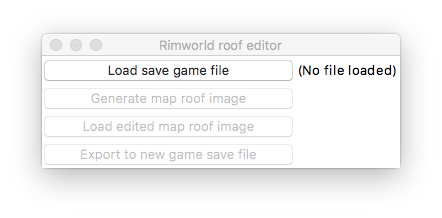
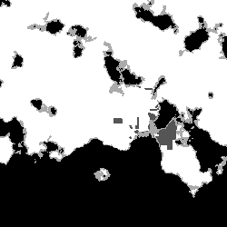
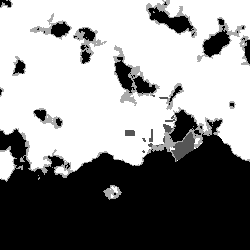

This is a (hopefully) temporary repo for a B18 compatible version of thearn's Rimworld Savegame Roof-type Editor:
https://github.com/thearn/Rimworld_roof_editor

Rimworld Savegame Roof-type Editor
====================================

Allows you to edit the roof type on any tile in a Rimworld savegame. I provides a method to visually change between constructed, thin rock, overhead mountain, or no roof on any of the map tiles in your game. This works for any map size.

Only tested with Rimworld 0.16 at the moment.

Usage
-------
Included is a GUI dialog to help in using the tool. 
This can be run by launching `dialog.py` with the appropriate Python dependancies, or by using one of the pre-built binary distributions for Windows, Mac OS X, or Ubuntu Linux.

First, the Rimworld savegame file (extension: `.rws`) must be loaded. The first (top) button will allow you to navigate and select your savegame file.

One your savegame is loaded, the 2nd button will export the current map roof tile configuration as a grayscale 8-bit bitmap (`.bmp`) file. Each pixel in this exported image is a cell in your map. 

Example output for a 250x250 map:

The four tones that show up in the image are the 4 seperate roof types. If you are editing a map that you have played in already, looking at the image itself should give you a hint as to which color is which roof type. The 4 tones are:

- 0: Overheat mountain
- 85: Constructed
- 170: Thin rock
- 255: No roof

To edit the roof type, use any bitmap editor that you like. Paint, GIMP, pretty much any image editor will work. You can use the eye-dropper tool to select the roof type you want to apply (e.g., total black will be overhead mountain). Apply this to any cell that you want using any tool that DOESN'T add gradient or edge blending, such as a pencil-type tool. The key here is to ONLY have the 4 colors corresponding to the roof types.

So assuming that I want to close in the open space in the south-east part of the map with overhead mountain, the edited image would look like:

Next, I would return to the dialog, and press the 3rd button labeled ("load edited map image"), and load the edited bitmap file.

Finally, I can export the savegame with the new roof data inserted by pressing the last button, and choosing a location for it (the Rimworld save game directory).

Notes
-------
I wrote this because my favorite playstyle on Rimworld is to pre-build a base with dev tools with basic infrastructure and partial sustainability, but poor weapons and resource stocks. I then turn up the difficulty on the AI storyteller.

Ideally, this up-front base building would allow me to build bunkers with appropriate roof types as I'd like, but the dev tools do not allow you to edit roofs. I found a [great reddit post](https://www.reddit.com/r/RimWorld/comments/44q9ci/how_to_edit_roofs_overhead_moutain/) that partially described the format of the rooftop data in the savegame files. I was able to complete the process of unpacking this format, and wrote this editor around that.

In short, the roof tiles in the game are a flattened list of ASCII characters located between the <roofs> XML tags. These are to be read 8 at a time, without regards to line placement. The remainder segment at the end of this block may be 8 charectors, but is treated the same way. 

Each of these 8-char-or-less segments are actually base-64 encodings of 1, 2, or 3 pairs of bytes (i.e. 2, 4 or 6 bytes altogether). After processing the blocks this way, you'll see a pattern pop out really quick. Each pairing of bytes represents a roof type in a single map tile.

The two-byte specific representation of roof types are:

- `0x00 0x00` : Empty roof
- `0x2b 0x1a` : Thin rock
- `0x0d 0x14` : Constructed
- `0x44 0x2a` : No roof

As noted in the original reddit post, the position in the overall string represents their location on the map.

Originally i was going to make a web-based service that would let users upload save files, present a web-based editor, and would then download the resulting edited savegame. This is 100% possible, but would be pretty expensive in terms of bandwidth to host considering the size of the savegame files. 

The offline editing-a-bitmap-with-GIMP process was really easy to make too. I'm open to other approaches too.

Software
----------
This tool was written with Python 2, using the `numpy` and `pillow` libraries.
Python 3 would not be too difficult to do. I went with Py2 because I knew I could play it fast and loose with bytes and strings, which is really the core of what this program is doing.

I'll happily accept a pull request for Py3 support, as long as it can pass my two basic CI regression tests.

